# WMware虚拟机环境搭建F5 BIG-IP Virtual Edition

## 注册账号

注册链接：https://login.f5.com/resource/registerEmail.jsp

## 下载镜像

### 获取激活License

获取激活License链接： https://downloads.f5.com/trial/

说明文档：https://devcentral.f5.com/s/articles/getting-started-with-big-ip-ve-trial-22469

- 填写下载目的

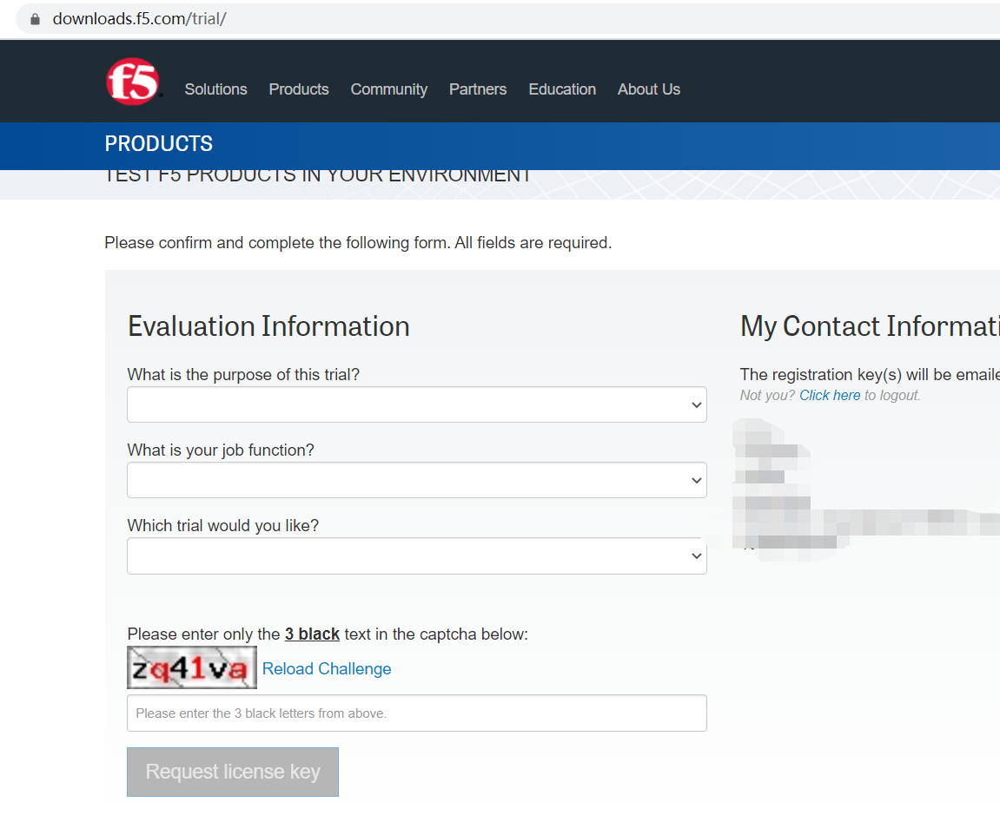

- 激活License会通过邮件发过来

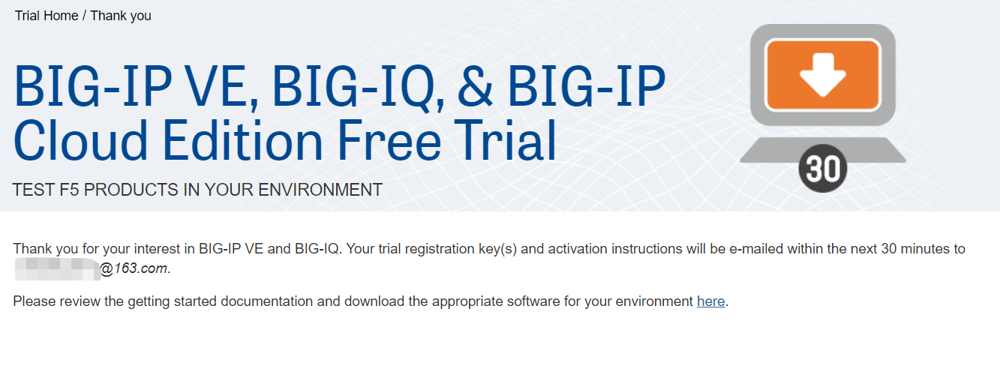

### 下载镜像

下载链接：https://downloads.f5.com/esd/productlines.jsp

- 选择版本

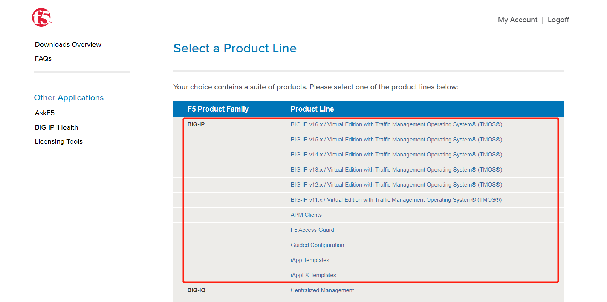

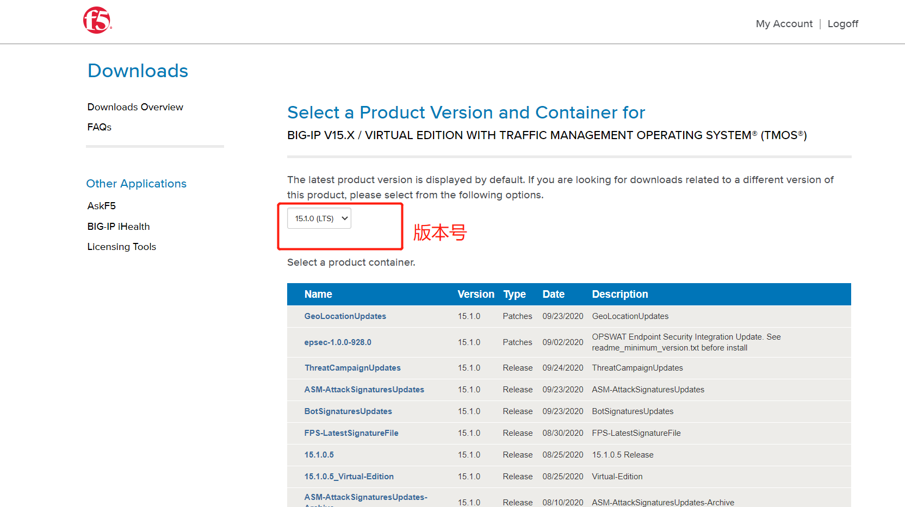

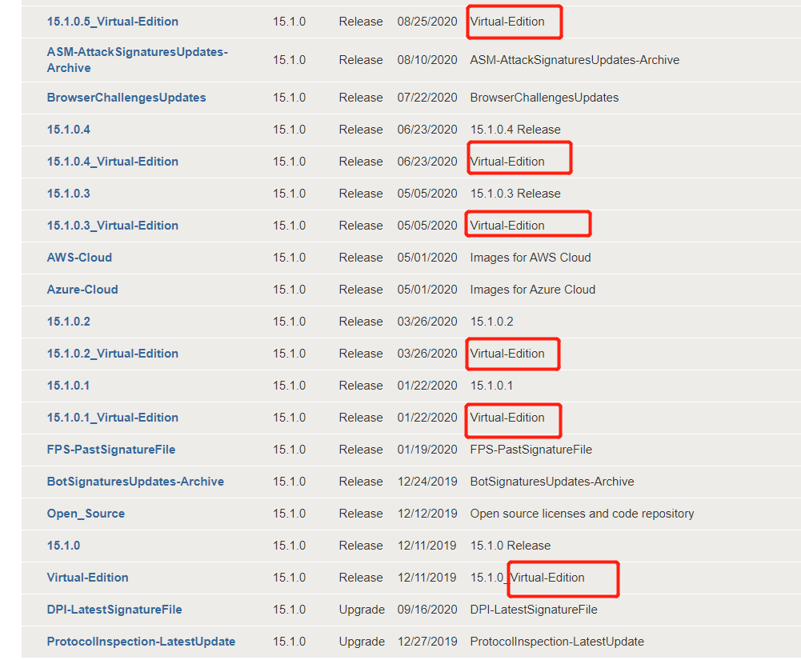

- 选择支持WMware的镜像下载

链接：https://downloads.f5.com/esd/eula.sv?sw=BIG-IP&pro=big-ip_v15.x&ver=15.1.0&container=Virtual-Edition&path=&file=&B1=I+Accept

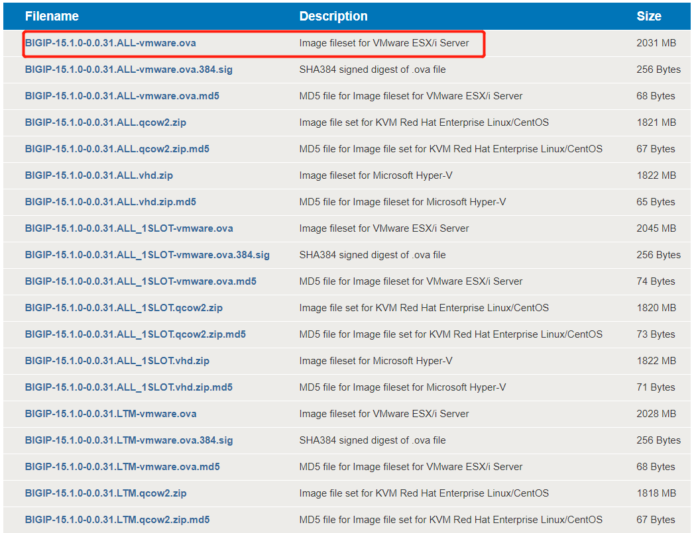

- 选择下载方式

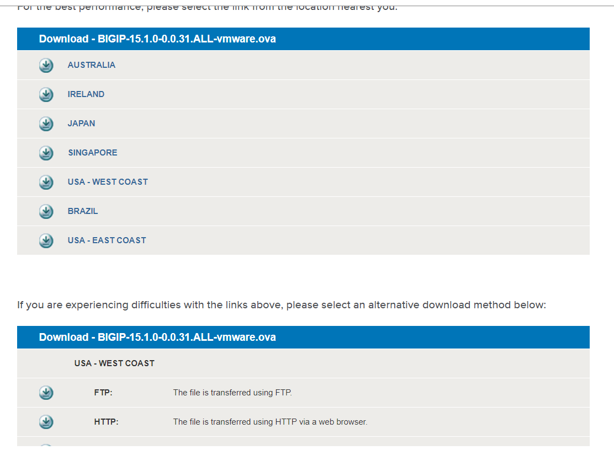

- 使用迅雷或者360极速浏览器选择日本节点下载（推荐）

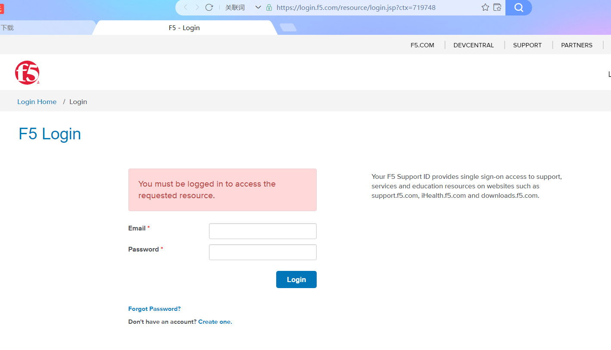

## 使用WMware导入F5

- 导入F5

打开VMware Workstation，点击“文件”的“打开”，选中下载的XXXX.ova虚拟版镜像。默认安装就可以。

- 查看虚拟机VMware Workstation的IP地址

点击“编辑”的“虚拟网络编辑器”，可以看到VMnet1和VMnet8的子网地址

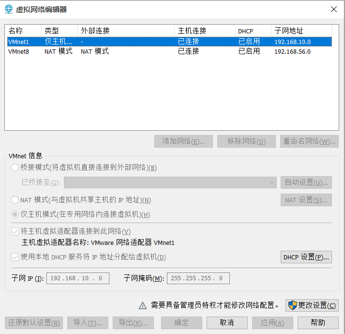

## 配置IP网络

> 使用默认IP也可以访问

- 启动F5，根据提示操作，修改密码等等。
  - root的默认密码为default

> **前提：BIOS启用了处理器虚拟化**

- 配置网络

1、命令行模式下输入“config”，打开Configuration Utility工具。 

2、提示是否选择默认IP地址192.168.0.1及子网掩码255.255.255.0，此时选择No，然后手动配置IP地址。 

3、配置IP时需要保持跟虚拟机网卡IP在同一网段（VMnet1或VMnet8），这里选择VMnet8的网段

> 注意：需要保持网络适配器模式相同，桥接模式、主机模式或者NAT模式

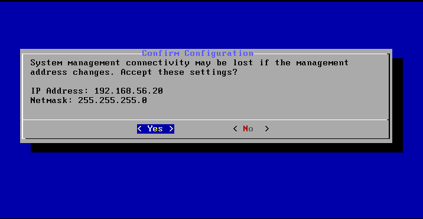

4、使用CMD  ping一下刚刚设置的IP，如果能IP通F5并且F5能ping通外网，则证明配置成功

> 如果F5 ping不同外网，则激活license时不是使用自动模式，需要手动模式

## license安装激活

- 浏览器中输入：https://192.168.56.20，账号是admin，密码是启动F5后你修改的密码

登录成功后，此时License是未激活的状态

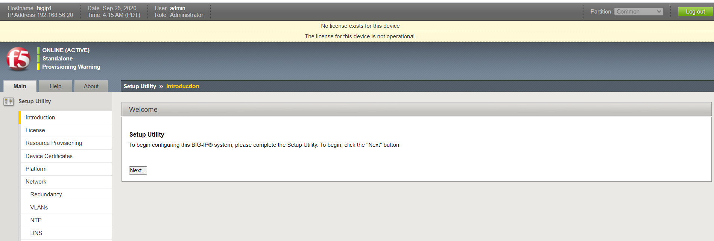

- 点击Next，然后点击Active按钮，按照提示输入申请到的邮箱里的registration key

- 由于这里的F5 ping不通外网，所以选择手动模式

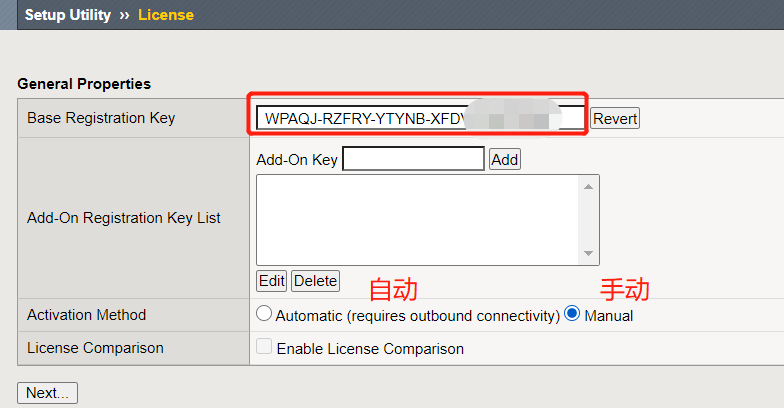

- 复制Dossier右侧的代码，并点击下方的“Click here to access F5 licensing Server”，进入F5 license 激活官网，粘贴该代码将会生成License

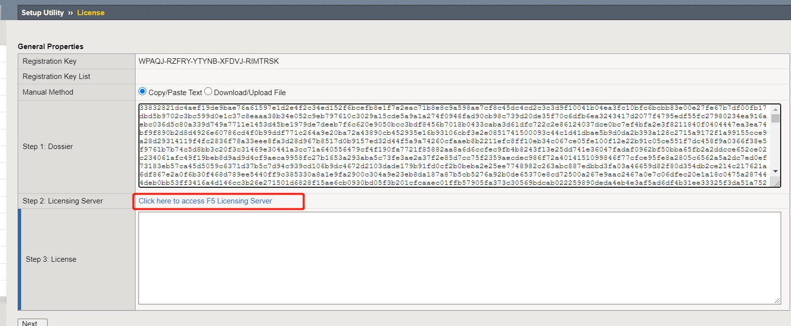

- 生成的license文件，可以选择另存到本地

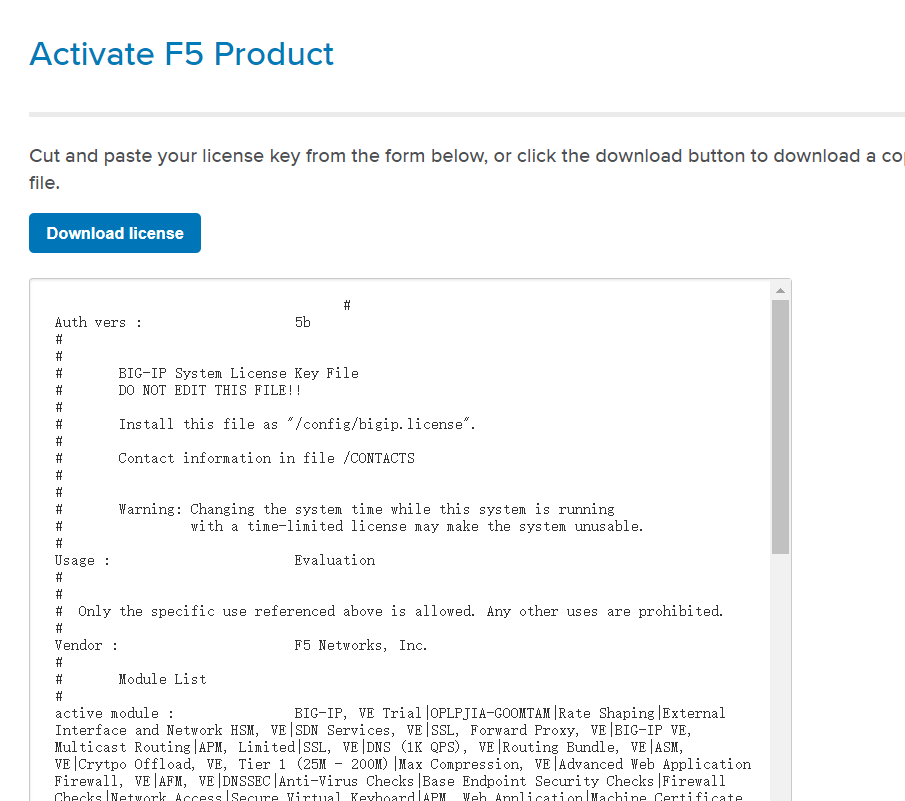

- 将该license文本复制到WEB界面的step 3右侧中，点击next以激活本地license

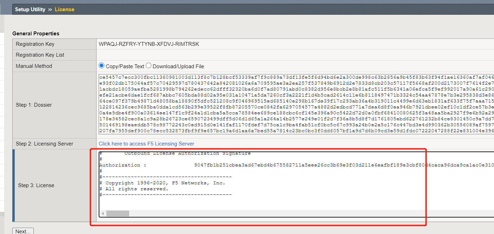

- 激活的页面

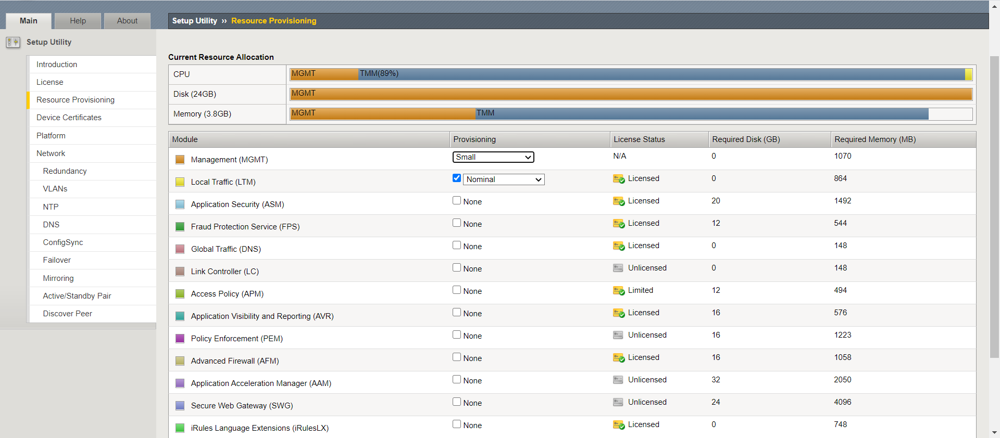

- 查看激活有效期，点击License

> 试用期过后，可以点击此界面下方的Re-activate按钮，重新导入新的License激活即可

